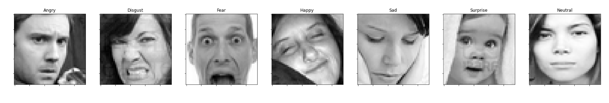
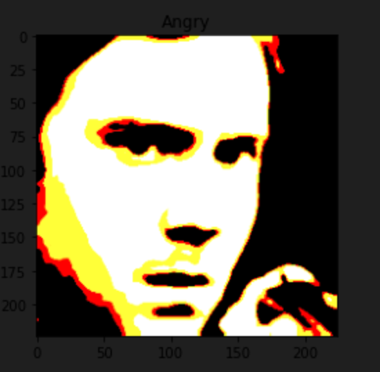
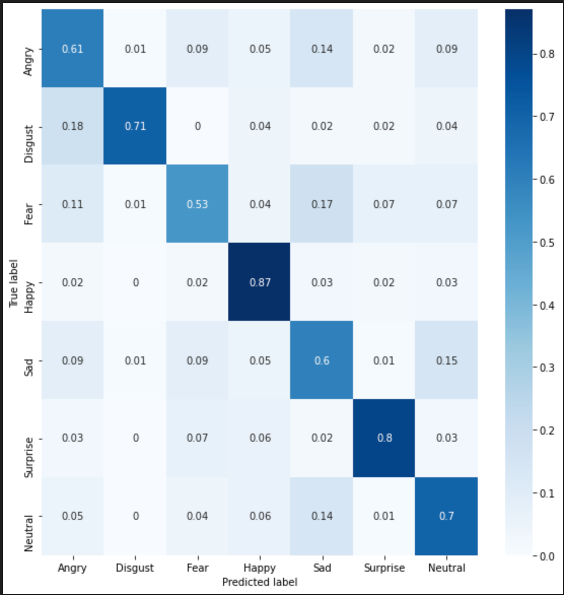
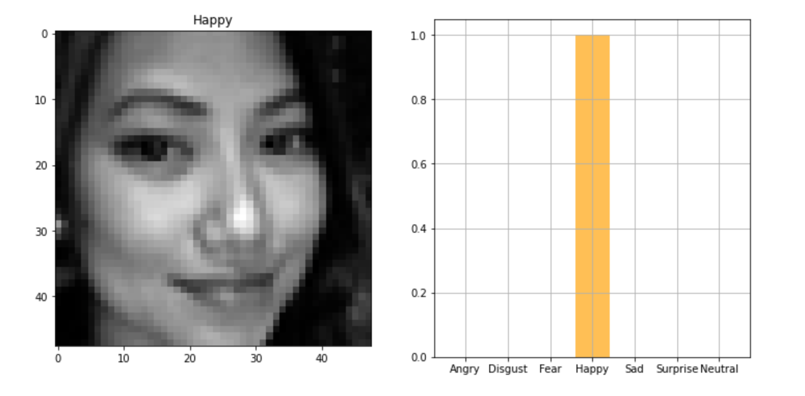
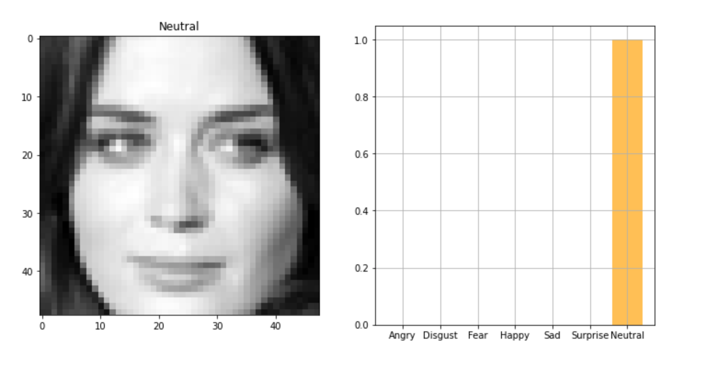

# Real-Time Emotion Detection iOS App with Machine Learning

This repo contains a real-time facial emotion detection iOS application developed as a personal project. The app utilizes CoreML with SwiftUI to provide an intuitive and interactive user experience.

This project builds a convolutional neural network (CNN) model to classify facial expressions from pixel images of faces. A Notebook is provided to train a facial expression recognition model using transfer learning with VGGFace on the FER2013 dataset. The model is trained and evaluated on the [ICML 2013 Face Expression Recognition Challenge](https://www.kaggle.com/c/challenges-in-representation-learning-facial-expression-recognition-challenge) dataset.


## Data


The dataset contains 35,887 grayscale 48x48 pixel face images with 7 emotions (angry, disgust, fear, happy, sad, surprise, neutral). The data is split into train, validation, and test sets. 

## Model



A pre-trained [VGGFace](https://arxiv.org/abs/1710.08092) model was used for transfer learning. VGGFace is a convolutional neural network trained on a large facial image dataset for face recognition.

The base model was frozen and new classifier dense layers were added on top and trained for facial expression classification into 7 classes.

The model was trained for 30 epochs using the Adam optimizer and categorical cross-entropy loss. Test accuracy reached ~70%.

I also made a non VGGFace model [here](https://colab.research.google.com/drive/1ljnCpndHomjXc5PDkJ2gsF9hbuMgynwg?usp=sharing) which achieved a worse accuracy of ~55%. 

## Results 

The model achieves ~70% accuracy on the test set. Analysis of the confusion matrix shows the model performs very well on the "happy" class with high precision and recall. It struggles more with "fear" and "sad" which are commonly misclassified as one another. 

  

The model shows decent precision and recall for "angry", "disgust", "surprise" and "neutral" but still commonly confuses between some classes like "sad" and "fear". 

Overall the model achieves reasonable but not excellent performance on this dataset. Some ways to potentially improve accuracy include tuning hyperparameters, training on more varied data, and exploring different model architectures.




## Installation

To run the iOS application, follow these steps:

1. Clone the repository to your local machine.

```bash
$ git clone https://github.com/andr3wV/CoreMLEmotionDetect.git
```

2. Open the project in Xcode.

3. Ensure you have the necessary dependencies installed. If any are missing, use CocoaPods or Swift Package Manager to install them.

4. Build and run the app on a connected iOS device or simulator.

To train the model, follow these steps:

1. Install the notebook dependencies
```bash
$ pip install -r requirements.txt
```
2. Download the training data from [this dataset](https://www.kaggle.com/competitions/challenges-in-representation-learning-facial-expression-recognition-challenge/overview)
4. Open the Jupyter Notebook 
	> facial_expression_recognition.ipynb
	
5. Run the notebook

## How to Use

1. Launch the application on your iOS device.

2. Grant necessary permissions for camera access.

3. Point the front camera at a human face.

## Contributing

Contributions to this project are welcome! If you find any bugs or have suggestions for improvements, please feel free to open an issue or submit a pull request. Also, if someone want to work on the UI, that would be greatly appreciated!

---
